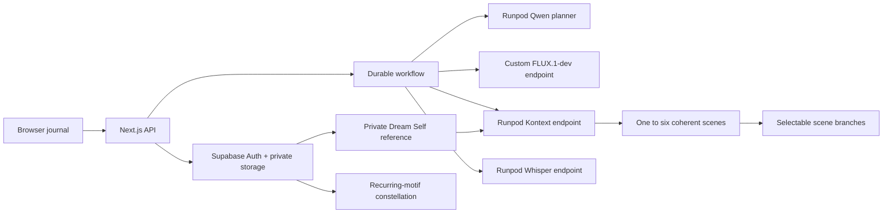
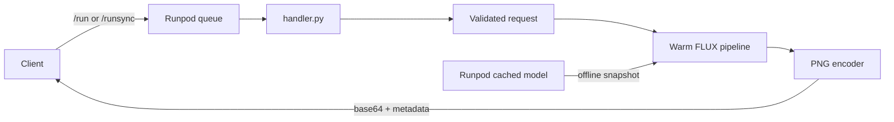

# DreamTrace — a Runpod-powered visual dream journal

This case study starts with the required custom Runpod Serverless endpoint for
[black-forest-labs/FLUX.1-dev](https://huggingface.co/black-forest-labs/FLUX.1-dev),
then turns it into a product: describe or record a dream, receive a coherent visual
story, revise a scene without regenerating the rest, and see recurring symbols
connect across a private journal.

Production: [dreamtrace.vercel.app](https://dreamtrace.vercel.app)

Status: the custom FLUX worker, Qwen planner, Kontext generation, Whisper transcription,
Supabase schema, and full DreamTrace workflow are deployed. Production includes the
optional private Dream Self photo, three illustration styles, adaptive one-to-six scene
stories, and recoverable scene editing. [docs/EVIDENCE.md](docs/EVIDENCE.md) records the
current release identity and live acceptance evidence.

## Product architecture



The browser receives an anonymous, cookie-bound Supabase identity. Row-level security
isolates dreams, motifs, scene versions, jobs, and private images. Durable workflows
persist every paid Runpod job before submission, poll the exact endpoint recorded with
that job, and make retries idempotent.

### What the app does

- Accepts text or microphone capture with transcript review.
- Optionally makes the dreamer recognizable from one private, normalized reference photo.
- Offers cinematic painting, watercolor memory, and graphic surreal illustration styles.
- Uses a dedicated Runpod Qwen3-4B-AWQ endpoint to produce a strict story plan.
- Chooses one to six scenes based on the dream's important visual beats instead of
  padding every memory to a fixed length.
- Without a Dream Self, generates the anchor with the required custom FLUX.1-dev worker,
  then uses Kontext for continuity. With a Dream Self, uses the same immutable face
  reference in every Kontext scene to prioritize recognizable identity.
- Lets the user branch one scene from an edit instruction and explicitly select the
  preferred version.
- Connects completed dreams through exact recurring motifs in an accessible,
  deterministic constellation.

See [docs/DREAMTRACE.md](docs/DREAMTRACE.md) for the product setup, evidence, paid demo
seed, and failure model.

## Required endpoint architecture



The model is loaded once when a worker starts, outside the per-job handler. Runpod
provisions the gated Hugging Face weights through its cached-model mount; inference is
offline and never downloads weights during a billed request.

## Live result


Prompt: `A small red panda astronaut reading a map on Mars, cinematic lighting`

The deployed endpoint generated this 1024×1024 PNG at 50 steps with seed 42. Runpod
reported 10.452 seconds of inference and 11.624 seconds of job execution. The response
identified model revision `3de623fc3c33e44ffbe2bad470d0f45bccf2eb21`.

## Request

Only `prompt` is required. The defaults match the FLUX.1-dev model card.

| Field | Type | Default | Constraint |
| --- | --- | --- | --- |
| `prompt` | string | required | 1–2,000 trimmed characters |
| `seed` | integer | random | 0–2^63−1 |
| `width` | integer | 1024 | 512–1024, divisible by 16 |
| `height` | integer | 1024 | 512–1024, divisible by 16 |
| `num_inference_steps` | integer | 50 | 1–50 |
| `guidance_scale` | number | 3.5 | finite, 0–10 |

Example:

```json
{
  "input": {
    "prompt": "A red panda astronaut reading a map on Mars, cinematic lighting",
    "seed": 42,
    "width": 1024,
    "height": 1024,
    "num_inference_steps": 50,
    "guidance_scale": 3.5
  }
}
```

Unknown fields and invalid values return Runpod's reserved top-level error marker. The
SDK therefore marks the job `FAILED` without serializing a Python traceback or returning
an error inside a `COMPLETED` job.

## Response

```json
{
  "image_base64": "iVBORw0KGgo...",
  "mime_type": "image/png",
  "seed": 42,
  "width": 1024,
  "height": 1024,
  "num_inference_steps": 50,
  "guidance_scale": 3.5,
  "model": {
    "id": "black-forest-labs/FLUX.1-dev",
    "revision": "<cached-commit>"
  },
  "metrics": {
    "inference_ms": 12345,
    "encoding_ms": 234,
    "total_ms": 12579,
    "png_bytes": 1234567
  }
}
```

The returned seed, model revision, and parameters make a successful generation
reproducible on the same software and hardware stack.

## Local verification

Python 3.12 and [uv](https://docs.astral.sh/uv/) are required.

```bash
uv sync --frozen --python 3.12
make typecheck
make test
make lint
```

The required order is typecheck, tests, then lint. The current suite contains 53 unit
tests. These tests do not download the gated model or require a GPU.

The product app has a separate verification sequence:

```bash
cd web
pnpm typecheck
pnpm test
pnpm lint
pnpm build
```

The web suite currently contains 208 GPU-free unit tests plus an opt-in linked-database
recovery test. The database fixture verifies idempotent audio preparation, atomic branch
and dream recovery, terminal branch retry, duplicate text and workflow claims, audio
format binding, Dream Self lifecycle, NULL identity guards, completion, and cross-user
RLS isolation, then deletes its anonymous users and one-pixel artifacts.

## Deploy and invoke

Follow [docs/DEPLOYMENT.md](docs/DEPLOYMENT.md) for the exact Runpod GitHub build and
endpoint settings. After deployment, set `RUNPOD_ENDPOINT_ID` in the ignored `.env` file,
load it into the shell, and invoke the asynchronous API:

```bash
set -a
source .env
set +a
uv run python scripts/invoke.py --output generated.png
```

For a presentation-only synchronous request:

```bash
uv run python scripts/invoke.py --sync --output generated.png
```

The client uses `/run` plus `/status` by default because FLUX cold starts can outlast a
single synchronous HTTP request. It validates the returned base64 and PNG signature
before writing the file.

## Documentation

- [Deployment runbook](docs/DEPLOYMENT.md)
- [Design decisions and tradeoffs](docs/DESIGN.md)
- [Testing and acceptance plan](docs/TESTING.md)
- [Live presentation runbook](docs/PRESENTATION.md)
- [DreamTrace product runbook](docs/DREAMTRACE.md)
- [Dream Self privacy and generation design](docs/DREAM_SELF.md)
- [DreamTrace web deployment](docs/WEB_DEPLOYMENT.md)
- [Production acceptance evidence](docs/EVIDENCE.md)

## Repository map

| Path | Purpose |
| --- | --- |
| `handler.py` | Runpod entry point and one-time worker initialization |
| `src/runpod_flux/` | Validation, cache resolution, inference, encoding, and logging |
| `Dockerfile` | Reproducible CUDA worker image without model weight downloads |
| `scripts/invoke.py` | Typed async/sync API client that saves the returned PNG |
| `tests/` | GPU-free unit tests |
| `.github/workflows/ci.yml` | Typecheck → test → lint pull-request gate |
| `web/` | DreamTrace Next.js app, durable workflows, tests, and live demo seeder |
| `supabase/migrations/` | Private journal schema, invariants, RLS, and workflow claims |

## Security and license

API and Hugging Face tokens are never committed, copied into the Docker build context,
or logged. `.env` is ignored and `.dockerignore` is an allowlist. The Hugging Face token
is entered only in Runpod's cached-model configuration.

FLUX.1-dev is governed by the
[FLUX.1-dev Non-Commercial License](https://huggingface.co/black-forest-labs/FLUX.1-dev/blob/main/LICENSE.md).
This repository contains integration code, not model weights.
