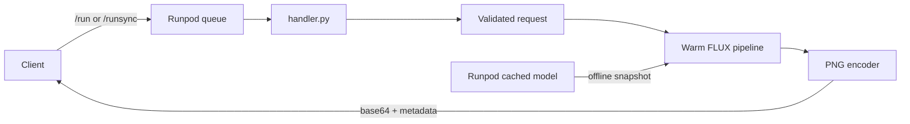

# FLUX.1-dev on Runpod Serverless

A queue-based Runpod Serverless worker that accepts a text prompt and returns a
base64-encoded PNG generated by
[black-forest-labs/FLUX.1-dev](https://huggingface.co/black-forest-labs/FLUX.1-dev).

Status: deployed from `main` through Runpod's GitHub integration and validated with live
H100 inference, deterministic replay, and failure-path testing.

## Architecture



The model is loaded once when a worker starts, outside the per-job handler. Runpod
provisions the gated Hugging Face weights through its cached-model mount; inference is
offline and never downloads weights during a billed request.

## Live result


Prompt: `A small red panda astronaut reading a map on Mars, cinematic lighting`

The deployed endpoint generated this 1024×1024 PNG at 50 steps with seed 42. Runpod
reported 10.452 seconds of inference and 11.624 seconds of job execution. The response
identified model revision `3de623fc3c33e44ffbe2bad470d0f45bccf2eb21`.

## Request

Only `prompt` is required. The defaults match the FLUX.1-dev model card.

| Field | Type | Default | Constraint |
| --- | --- | --- | --- |
| `prompt` | string | required | 1–2,000 trimmed characters |
| `seed` | integer | random | 0–2^63−1 |
| `width` | integer | 1024 | 512–1024, divisible by 16 |
| `height` | integer | 1024 | 512–1024, divisible by 16 |
| `num_inference_steps` | integer | 50 | 1–50 |
| `guidance_scale` | number | 3.5 | finite, 0–10 |

Example:

```json
{
  "input": {
    "prompt": "A red panda astronaut reading a map on Mars, cinematic lighting",
    "seed": 42,
    "width": 1024,
    "height": 1024,
    "num_inference_steps": 50,
    "guidance_scale": 3.5
  }
}
```

Unknown fields and invalid values return Runpod's reserved top-level error marker. The
SDK therefore marks the job `FAILED` without serializing a Python traceback or returning
an error inside a `COMPLETED` job.

## Response

```json
{
  "image_base64": "iVBORw0KGgo...",
  "mime_type": "image/png",
  "seed": 42,
  "width": 1024,
  "height": 1024,
  "num_inference_steps": 50,
  "guidance_scale": 3.5,
  "model": {
    "id": "black-forest-labs/FLUX.1-dev",
    "revision": "<cached-commit>"
  },
  "metrics": {
    "inference_ms": 12345,
    "encoding_ms": 234,
    "total_ms": 12579,
    "png_bytes": 1234567
  }
}
```

The returned seed, model revision, and parameters make a successful generation
reproducible on the same software and hardware stack.

## Local verification

Python 3.12 and [uv](https://docs.astral.sh/uv/) are required.

```bash
uv sync --frozen --python 3.12
make typecheck
make test
make lint
```

The required order is typecheck, tests, then lint. The current suite contains 53 unit
tests. These tests do not download the gated model or require a GPU.

## Deploy and invoke

Follow [docs/DEPLOYMENT.md](docs/DEPLOYMENT.md) for the exact Runpod GitHub build and
endpoint settings. After deployment, set `RUNPOD_ENDPOINT_ID` in the ignored `.env` file,
load it into the shell, and invoke the asynchronous API:

```bash
set -a
source .env
set +a
uv run python scripts/invoke.py --output generated.png
```

For a presentation-only synchronous request:

```bash
uv run python scripts/invoke.py --sync --output generated.png
```

The client uses `/run` plus `/status` by default because FLUX cold starts can outlast a
single synchronous HTTP request. It validates the returned base64 and PNG signature
before writing the file.

## Documentation

- [Deployment runbook](docs/DEPLOYMENT.md)
- [Design decisions and tradeoffs](docs/DESIGN.md)
- [Testing and acceptance plan](docs/TESTING.md)
- [Live presentation runbook](docs/PRESENTATION.md)

## Repository map

| Path | Purpose |
| --- | --- |
| `handler.py` | Runpod entry point and one-time worker initialization |
| `src/runpod_flux/` | Validation, cache resolution, inference, encoding, and logging |
| `Dockerfile` | Reproducible CUDA worker image without model weight downloads |
| `scripts/invoke.py` | Typed async/sync API client that saves the returned PNG |
| `tests/` | GPU-free unit tests |
| `.github/workflows/ci.yml` | Typecheck → test → lint pull-request gate |

## Security and license

API and Hugging Face tokens are never committed, copied into the Docker build context,
or logged. `.env` is ignored and `.dockerignore` is an allowlist. The Hugging Face token
is entered only in Runpod's cached-model configuration.

FLUX.1-dev is governed by the
[FLUX.1-dev Non-Commercial License](https://huggingface.co/black-forest-labs/FLUX.1-dev/blob/main/LICENSE.md).
This repository contains integration code, not model weights.
