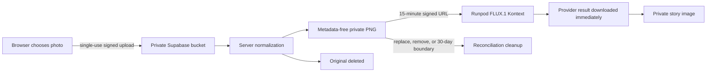

# Dream Self privacy and generation design

## User outcome

A user may add one clear photo before telling a dream. DreamTrace treats that person as
the “I” in the memory and keeps them recognizable across every important visual moment.
The feature is optional: the original custom FLUX.1-dev story path remains fully usable
without a photo.

## Data flow

The browser never receives service credentials. Supabase anonymous authentication owns
the reference, RLS permits only owner reads, and all mutation functions are callable
only by the server role. The provider URL is created after the logical job is ready to
submit and is excluded from the idempotency hash.

## Lifecycle invariants

- Input is JPEG, PNG, or WebP, at most 8 MB and 25 million decoded pixels. The server
  checks the decoded format and rejects a mismatch with the declared upload MIME type.
- The normalized reference is 256–2,048 pixels per side, sRGB PNG, and has no EXIF.
- Consent is mandatory and recorded as the versioned `dream-self-v1` contract.
- Replacement activates the new image only after normalization and database completion;
  the old image remains intact until then.
- A reference attached to work updated in the last 24 hours cannot be removed.
- New dreams cannot select a reference past its 30-day retention boundary.
- Deletion removes known source and normalized paths. A delayed tombstone sweep retries
  the deterministic normalized path, closing late-write races.
- Finished story images are independent private artifacts; deleting the source reference
  does not erase an already-created story.

## Generation paths

| Story | Scene one | Later scenes | Continuity source |
| --- | --- | --- | --- |
| No photo | Custom FLUX.1-dev endpoint | FLUX.1 Kontext | Selected scene-one image |
| Dream Self | FLUX.1 Kontext | FLUX.1 Kontext | Same normalized face reference |
| Scene edit | FLUX.1 Kontext | n/a | Selected scene version |

The custom worker remains the independently testable required deliverable and the
default anchor path. The identity path intentionally uses Runpod's public Kontext model
because it accepts an image reference without training or persisting a user-specific
adapter.

## Failure behavior

- A signed-URL failure happens before the paid job claim, so a safe retry remains possible.
- An ambiguous database completion is reread and reconciled before any normalized object
  is removed. If that reread is also unavailable, the normalized object is preserved for
  reconciliation; a lost success response cannot corrupt a committed reference.
- Replays compare identity ID, content hash, style, prompt, model, endpoint, and seed.
- Provider images must come from an approved HTTPS Runpod image host. Redirect targets
  are revalidated, credentials and custom ports are rejected, and bytes plus PNG signature
  are bounded before private storage.
- If private storage succeeds but database completion definitively fails, the exact
  orphan is removed. Ambiguous completion preserves it for reconciliation.
- Ambiguous Runpod submission still stops for reconciliation instead of risking duplicate
  paid work.
- Expired, abandoned, replaced, and deleted references are processed by the authenticated
  maintenance sweep; partial failures return a non-success status for monitoring.

## Deliberate limitations

The server validates format, dimensions, and decoded size but does not run face detection.
The UI therefore asks for one clear photo and the generated result remains the final
quality check. A production release would evaluate single-face detection for bias and
false rejection before making it a gate. Anonymous journals are device-bound until an
account-linking flow is added. Removing Dream Self does not delete completed story images;
finished-journal deletion and configurable retention remain future privacy work.
